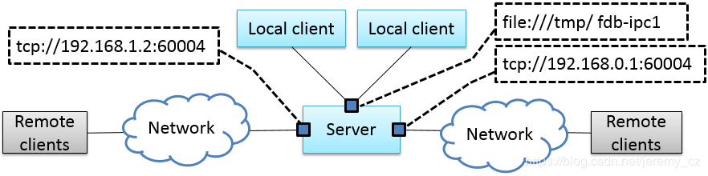
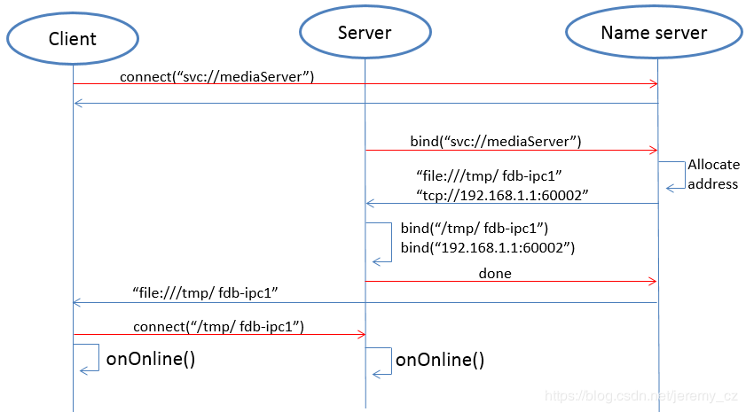
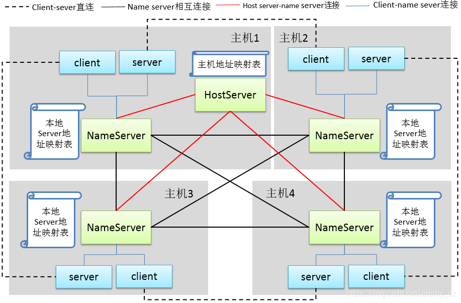

FDBus Manual
============

Abstract
--------

This manual describes a new type of ``IPC`` mechanism: Fast Distributed Bus (``FDBus``). 
From the perspective of ``IPC`` (Inter-Process Communication), ``FDBus`` has similarities 
with widely used ``D-Bus`` (Desktop Bus), but ``FDBus`` has its own advantages, more complete 
functions, higher performance and convenient use, in addition to supporting ``IPC`` in the host. 
It can also be networked between multiple hosts, and can customize security policies to support 
different security levels. ``FDBus`` is built on sockets (``Unix`` domain and ``TCP``) and 
serialized and deserialized using Google protobuf. ``FDBus`` supports the name of a string as 
the server address. The ``name server`` automatically assigns a ``Unix`` domain address and a 
``TCP`` port number to the server, so that the service name is used between the client and the server.

``FDBus`` aims to provide a connection-oriented, scalable, secure and reliable ``IPC`` mechanism 
between client-servers, and then develop into a middleware development framework for cross-platform 
(``Windows``, ``QNX``, ``Linux``), multi-threaded/multi-process middleware layers which working together. 
The ``FDBus`` development framework is suitable for developing interactive and complex distributed 
projects on custom systems, including:

- Linux-based vehicle ``ECU``, including instrumentation, entertainment host, TBox, 
  domain controller connected via Ethernet
- Communication between multiple Guest OSs on ``Hypervisors``
- Provide cross-host ``IPC`` mechanism for Android system (currently does not support ``Java API``)
- Small communication devices based on ``Linux``, such as home routers
- Other Linux-based industrial equipment, smart equipment
- Automated test equipment based on ``Windows`` development

You may get the open source code of ``FDBus`` on Github:
  https://github.com/jeremyczhen/fdbus.git

Background
----------

Unlike other cores, ``Linux`` has not had its own unique and easy-to-use ``IPC`` mechanism. 
``Windows``, ``Mac OS``, and ``QNX`` all have such a mechanism. Even Linux-based ``Android`` 
has developed a binder for ``IPC``. The ``Linux kernel`` only provides some of the most basic 
components - socket, pipe, message queue, shared memory, and so on. This is also in line with 
the ``Linux`` philosophy: each tool only does one thing and does it well. But the reality is 
often very complicated, and only one thing can't solve the problems encountered in reality, 
let alone product development and large commercial projects. For example, subscription-broadcasting 
is a basic communication requirement, but no basic component can satisfy it.

Actually ``Linux`` has a powerful ``IPC``: ``D-Bus``. It has sophisticated method invocation mechanisms 
and event broadcast mechanisms; it also includes advanced features such as security policies and 
on-demand startup of services. But the biggest controversy about it is performance: its performance is 
very low, due to the daemon relay, a request-reply needs to replicate ten times, four message verification, 
and four context switches. Therefore, it can only be used to handle control commands and message delivery 
with lower real-time requirements and smaller data volume, otherwise it will have to resort to the basic 
``IPC`` framework. For this reason, someone wrote ``D-Bus`` into the kernel and generated ``KDBus``. 
Although the performance is improved, the disadvantages are obvious. It can only be run on a single machine 
and does not support cross-host. In this case, Android's Binder is also sufficient, and Binder has been 
accepted by the kernel. ``KDBus`` has not yet `"turned positive"`. In addition, whether it is DBus or 
``KDBus``, the provision of the basic API, there is still a big gap from the "middleware development framework." 
However, there is an increasing demand for various industries, including the automotive industry, so that 
various DBus packages are produced: Qt DBus, gDBus, commonAPI, ``DBus-C++``... But these packages are either 
subordinate to the big frame. Or lack of maintenance, in short, it is not friendly to use.

In the automotive field where ``Linux`` and ``Ethernet`` are used more and more widely, the lack of suitable 
``IPC`` has gradually become a prominent problem: the company's original ``IPC`` mechanism is backward due to 
backward technology and obvious customization, and it has been unable to meet the requirements of distributed, 
high performance and security. However, it is unable to find a suitable ``IPC`` mechanism for the new platform, 
let alone a middleware development framework derived from the ``IPC`` mechanism. ``Ethernet`` in-vehicle applications 
have spawned ``SOME/IP`` (Scalable service-Oriented MiddlewarE over IP). SOME/IP is also a relatively complete 
``IPC`` specification, even developed specifically for the automotive industry. But as the name implies, it is 
based on the IP layer and does not perform well on a single machine. And ``SOME / IP`` open source implementation 
is also very few, GENIVI organization contributed vsomeip, but the activity is very low, ``GENIVI`` itself is a 
loose organization, more participants, fewer developers. Unlike ``DBus``, ``SOME/IP`` is built for the car and has 
a narrow range of applications. It is impossible to expect an active community to gather a group of professional 
programmers to maintain open source (this is probably why ``GENIVI`` is not a climate). Finally, it is very likely 
that you have to pay for closed source software.

``FDBus`` was developed to solve the above problems and has the following characteristics:

- Distributed: Based on TCP sockets and Unix Domain sockets (``UDS``), it can be used for both local 
  ``IPC`` and ``IPC`` between network hosts.
- Cross-platform: Currently verified on ``Windows``, ``Linux`` and ``QNX``
- High performance: point-to-point direct communication, not forwarded through a central hub or broker
- Security: Ability to configure different levels of access for server method calls and event broadcasts. 
  Only clients with high enough permissions can characterize methods and receive specific events.
- Service name resolution: The server address is identified by name, the service is registered by 
  the ``name server``, and the name is resolved, so that the server can be deployed anywhere on the network.
- Support cross-platform middleware development framework, including the following components:
 * Thread model
 * Event Loop
 * Job-to-thread communication based on Job-Worker
 * Event Loop based Timer
 * Event Loop based watch
 * Mutex
 * Semaphore
 * Socket
 * Notification
- ``IPC`` adopts Client-Server mode and supports the following communication modes:
 * Sync request with timeout - reply
 * Asynchronous request with timeout - reply
 * Unanswered command request
 * Registration-release mode for multicast
- ``IPC`` message serialization and deserialization using Protocol buffer, support IDL code generation, 
  efficient and simple; also supports raw data format, convenient for large data transmission
- Reliable heartbeat and reconnection mechanisms ensure that all parties remain connected regardless 
  of network conditions, regardless of which service is back online or restarted
- C++ implementation, easy to develop and maintain

Mainstream IPC framework comparison
-----------------------------------

+------+--------+-----------------+---------+--------------+-----------+--------------------+----------+----------+------------+
|      || Bottom| performance     || Sync   || Asynchronous|| Request  ||    Cross-host     || Message || Cross-  || security  |
|      || layer |                 || request||  request    || timed out|                    || push    || platform|| strategy  |
+======+========+=================+=========+==============+===========+====================+==========+==========+============+
|FDBus | Socket || Point-to-point,|   YES   |      YES     |    YES    || YES               || YES     || Window  || YES       |
|      |        || high           |         |              |           || with timeout      || with    || Linux   || Developing|
|      |        || performance,   |         |              |           || and heartbeat     || simple  || QNX     |            |
|      |        || second only to |         |              |           || to ensure reliable|| string  |          |            |
|      |        || Binder         |         |              |           || connection        || matching|          |            |
+------+--------+-----------------+---------+--------------+-----------+--------------------+----------+----------+------------+
|GDBus | Socket || Turned by      |    YES  |      YES     |    YES    || YES               || YES     || Window  || YES       |
|      |        || daemon,        |         |              |           || but needed        || with    || Linux   || Developing|
|      |        || lower          |         |              |           || maintaining       || complex || QNX     |            |
|      |        || performance    |         |              |           || reconnection when || matching|          |            |
|      |        |                 |         |              |           || network fails     ||         |          |            |
+------+--------+-----------------+---------+--------------+-----------+--------------------+----------+----------+------------+
|Binder|| Binder|| Direct copy,   |   YES   || YES         || YES      |         NO         || YES     || Only    | YES        |
|      || driver|| highest        |         || but need to || but need |                    || but need|| Linux,  |            |
|      |        || performance,   |         || use a       || to       |                    || to use a|| requires|            |
|      |        ||                |         || callback    || increase |                    || callback|| kernel  |            |
|      |        |                 |         || package     |           |                    || package || driver  |            |
+------+--------+-----------------+---------+--------------+-----------+--------------------+----------+----------+------------+

Middleware model based on FDBus
-------------------------------

The following figure is an example of a middleware layer based on ``FDBus`` development:

.. image:: ./images/1.png
  :width: 600px

The middleware layer contains multiple processes, whether they are on the same host system or 
on different host systems. Each process can run multiple threads. ``FDBus`` runs a specific event 
loop on a thread basis, enhancing the generic thread to a worker thread capable of executing jobs, 
timers, and watches. The communication side of ``FDBus``: client and server are collectively called 
endpoint. Endpoints can be deployed on different workers; multiple endpoints can also share the 
same worker. "Endpoint deployed on the worker" means that the event processing of the endpoint 
is executed on the worker. For example, the server processes the client request on the specified 
worker; the client processes the asynchronous reply and the broadcast event of the server on the 
specified worker. Middleware developers can use a worker to handle multiple endpoint events 
according to the actual situation, avoiding consuming too many threads, and avoiding the 
"concurrency disaster" caused by multithreading. Developers can also use multiple workers for 
an endpoint service. For example, endpoint can create worker threads to complete time-consuming 
file downloads, video codecs, peripheral IO operations.

Multi-threaded collaborative work requires that messages and data be passed between threads. 
For example, if the file is downloaded, the endpoint should be notified for subsequent processing. 
In the process, because the same address space can be accessed, the best communication carrier is 
the object - both data can be carried and the data can be processed. Job is the object that 
``FDBus`` transfers between threads, and realizes inter-process communication through the transfer 
and execution of jobs between threads.

A more important feature of ``FDBus`` is interprocess communication (``IPC``). Objects cannot be 
directly passed between processes, can only interact in the form of messages, and need to be 
serialized during message transmission. After receiving the message, deserialization is required. 
Each ``IPC`` mechanism, including ``Binder``, ``SOME/IP``, and ``DBus``, has its own serialization 
method. The quality of serialization directly affects communication efficiency, load, support for 
data structures, and ease of use. ``FDBus`` does not have its own serialization method, directly uses 
google protocol buffer, easy to use, full-featured, and supports idl automatic code generation. 
Data is communicated between processes using sockets, including Unix Domain Sockets (``UDS``) and 
``TCP`` sockets. Which type is used, the system will automatically choose according to the deployment 
of Client and Server: if ``UDS`` is used inside the same host, otherwise ``TCP`` socket is used. 
For ``Windows``, since ``UDS`` is not supported, all ``TCP`` sockets are used.

FDBus addressing and networking
-------------------------------

Server address
^^^^^^^^^^^^^^

The server address is the identifier of the server in the network. Through this identifier, 
the client can find the specified server and establish communication with it. As mentioned 
earlier, FDBus supports ``UDS`` and TCP sockets, each with its own naming and namespace. To unify 
``FDBus``, use the following rules to define the server address:

- ``UDS``: file://socket filename
- ``TCP`` socket: tcp://ip address: port number

Different from the socket server in the general sense, the ``FDBus`` server can bind multiple addresses 
at the same time, and each address can accept the connection of the client. Once connected, each address 
provides the same service, so the client can choose any address to establish a connection. The following 
is a schematic diagram of the ``FDBus`` server address binding:

In the figure above, the server is bound to a ``UDS`` address: ``file:///tmp/fdb-ipc1``. The client on the 
same host can use this address to initiate a connection, of course, can also connect to any other address, 
but undoubtedly the most efficient use of ``UDS``, and ``UDS`` support peer credentials, and thus support 
security policies. Because the host has multiple network ports, the server can also bind one address 
(port number) to each network port: ``tcp://192.168.1.2:60004`` and ``tcp://192.168.0.1:60004``. Each address 
is used to connect to the client of the corresponding network segment.

Server naming and address assignment
^^^^^^^^^^^^^^^^^^^^^^^^^^^^^^^^^^^^

It is inconvenient to use the above address to locate the server. It is not intuitive. The address will 
change with the networking mode and cannot be deployed flexibly. To this end, ``FDBus`` has added an 
addressing mode: server name addressing. Each server can have its own name; run a service called ``name server``, 
which is responsible for assigning addresses to the server, managing the mapping between server names and 
addresses, parsing the server name, and issuing the server address. The ``name server`` is a bit like the 
``DNS`` on the internet. To support server name addressing, add a format to the two URLs, as the name and 
address, as follows:

- svc://servername

The name address is a virtual address. No matter where the server is located, as long as its name and address 
are unchanged, the client can establish contact with it through this address. If the server calls ``bind()`` to bind 
the name address (the address starting with svc://), the ``name server`` will assign the actual address (the address 
starting with tcp:// or file://) and register the name and address to In the mapping table. If the client connects 
to the name and address, the ``name server`` will look up the actual address of the server according to the name and 
select the most appropriate actual address to publish to the client. The client establishes a point-to-point direct 
connection with the server through this address. The following figure shows the process of establishing a connection 
between the client and the server using the name and address with the help of the ``name server``:

First, the client calls connect("svc://medisServer") to establish a connection with the server named mediaServer. 
Since the name is used, ``FDBus`` will ask the name server for the actual address of the mediaServer. 
But now mediaServer is not online yet, so the name cannot be resolved, just subscribe to the online 
notification of the service. Soon after, the server calls bind("svc://mediaServer") to go online. 
Since the name and address are used, the request will also be sent to the name server. The ``name server`` 
registers its name, assigns ``UDS`` and ``TCP`` addresses, and returns it to the server. The server is 
bound to each actual address, and the n``ame server`` is notified after success. The ``name server`` 
issues the server online message and the server address to the entire system: the ``UDS`` address is 
broadcast to the local client, and the client address is the ``TCP`` address broadcast to other nodes. 
The client uses the received address to establish a connection with the server, and both the client and 
the server can receive the event notification of onOnline().

The name server uses the following rules to assign a server address:

+--------------+------------------------------+-----------------+
| Server       |         TCP Address          |   UDS Address   |
+==============+==============================+=================+
| host server  |        port No. 6100         |   /tmp/fdb-ns   |
+--------------+------------------------------+-----------------+
| name server  |        port No. 6101         |   /tmp/fdb-ns   |
+--------------+------------------------------+-----------------+
| user servers || Port 61002 – Port 65535     || /tmp/fdb-ipc0, |
|              || or                          || /tmp/fdb-ipc1, |
|              || Automatic system allocation || ...            |
+--------------+------------------------------+-----------------+

Multi-host networking
^^^^^^^^^^^^^^^^^^^^^

Since the address of the ``name server`` is fixed, the endpoint will automatically connect to the ``name server`` 
registration (server) or resolution (client) name after the endpoint is started. If there are multiple hosts, 
each running their own ``name server``, responsible for their respective name services, then these hosts 
become islands and cannot be connected to each other through service names such as svc://server_name. 
Of course, the client can bypass the ``name server`` and directly connect to the server with the actual 
address, but this cannot be flexibly deployed and networked. In order to support name resolution across 
networks, a service is required to manage all hosts in the system, and the host information is synchronized 
to all ``name servers``. These ``name servers`` can establish connections and work together to complete the name 
service within the entire network. . This service is the host server.

The working principle of the host server is: the entire network runs a host server, which can be located 
on any host that everyone can access. All host name servers are connected to the host server, registering 
their own host. The host server maintains a list of hosts containing the IP addresses of the hosts and 
synchronizes the tables to all ``name servers`` on the network. The ``name server`` establishes a connection 
with the name server on all hosts in the network according to the table.

Once the ``name servers`` on all hosts are connected in pairs, the service name resolution and service 
online notification can be completed through a set of internal protocols. For example, when a client on 
a host requests the local name server to resolve the address corresponding to the service name, the local 
``name server`` can broadcast the request to all connected ``name servers`` to find services in the entire 
network. The following is an example diagram of the entire system networking:

In the above figure, a star connection is established between the ``name server`` and the host server, 
and the ``name server`` and the ``name server`` are connected one after another to form a network. 
In this system, the main tasks of the ``name server`` and host server are:

- ``Name server`` is connected to the host server, and the host is registered to the host server.
- The host server collects all host information to form a host address table.
- The host server broadcasts the host address table to all name servers.
- All servers are connected to the local ``name server`` and register the service name with them. 
  The local ``name server`` broadcasts the newly registered service to the local client and all 
  other ``name servers`` in the network.
- After the other ``name server`` receives the broadcast, it also makes a broadcast locally and 
  notifies all clients. In this way, the service online message is spread to the entire network.
- All clients are connected to the local ``name server`` and apply for service name resolution. 
  The local ``name server`` searches its own server address mapping table and sends the application 
  to all other ``name servers``.
- After receiving the application, other ``name servers`` search their respective server address 
  mapping tables and return the result to the ``name server`` that initiated the application.
- The ``name server`` forwards the received return result to the client that initiated the application, 
  and the client establishes a direct connection with the service using the actual address in the result. 
  In this way, you can find services on all hosts.

As can be seen from the above figure, once the connection is established between the client and the server, 
all communication is completed through this connection without forwarding through the intermediate link.

Uniqueness of the service name
^^^^^^^^^^^^^^^^^^^^^^^^^^^^^^

Since each host has its own ``name server``, the service cannot be renamed inside the host, but it can be 
renamed on different hosts. In this case, when the client requests name resolution, it may receive feedback 
from different hosts. The client can customize the connection policy: always connect to the new server, 
only connect to the first server, or only connect to the specified server.

Heartbeat detection, reconnection and online, offline detection
^^^^^^^^^^^^^^^^^^^^^^^^^^^^^^^^^^^^^^^^^^^^^^^^^^^^^^^^^^^^^^^

In order to make the whole system run reliably and ensure that any service can be gracefully restarted 
(the entire system still works normally after restarting), ``FDBus`` has perfect heartbeat detection and 
online and offline detection mechanisms:

- There is a reconnection mechanism between endpoints and ``name server`` to ensure that the endpoint 
  can always establish a connection with the ``name server`` after restarting.
- There is heartbeat detection between the ``name server`` and the host server; once the heartbeat 
  disappears, the ``name server`` will try to reconnect with the host server to ensure the reliability of 
  the connection between the ``name server`` and the host server.
- The connection between the ``name server`` and the ``name server`` is established by the host server. 
  When the ``name server`` goes online, the host server notifies all other ``name servers`` to establish a 
  connection with it, and also informs the ``name server`` to establish a connection with all other 
  ``name servers``.
- The connection between the client and the server is established by the ``name server``. When the server 
  goes online, the ``name server`` notifies the client to establish a connection with it.

Security
--------

Host node authentication
^^^^^^^^^^^^^^^^^^^^^^^^

|        | Security Level 0 | Security Level 1 | Security Level 2 | Security Level 3 |
| ------ | ---------------- | ---------------- | ---------------- | ---------------- |
| host 1 | token10          | token11          | token12          | token13          |
| host 2 | token20          | token21          | token22          | token23          |
| host 3 | token30          | token31          | token32          | token33          |

|                       | host 1  | host 2  | host 3  |
| --------------------- | ------- | ------- | ------- |
| host 1 (MAC address1) | NA      | token22 | token31 |
| host 2 (MAC address2) | token13 | NA      | token33 |
| host 3 (MAC address3) | token12 | token23 | NA      |

Service access authentication
^^^^^^^^^^^^^^^^^^^^^^^^^^^^^

|          | Security Level 0 | Security Level 1 | Security Level 2 | Security Level 3 |
| -------- | ---------------- | ---------------- | ---------------- | ---------------- |
| server 1 | token10          | token11          | token12          | token13          |
| server 2 | token20          | token21          | token22          | token23          |
| server 3 | token30          | token31          | token32          | token33          |

|                      | server1 | server2 | server3 | server4 |
| -------------------- | ------- | ------- | ------- | ------- |
| client1 (uid1:guid1) | token12 | token22 | token31 | token43 |
| client2 (uid2:guid2) | token13 | token21 | token33 | token43 |
| client3 (uid3:guid3) | token12 | token23 | token33 | token41 |

Security level and access rights
^^^^^^^^^^^^^^^^^^^^^^^^^^^^^^^^

Security policy configuration file
^^^^^^^^^^^^^^^^^^^^^^^^^^^^^^^^^^

Parameter configuration file /etc/fdbus/fdbus.fdb
^^^^^^^^^^^^^^^^^^^^^^^^^^^^^^^^^^^^^^^^^^^^^^^^^

Host configuration file /etc/fdbus/host.fdb
^^^^^^^^^^^^^^^^^^^^^^^^^^^^^^^^^^^^^^^^^^^

Server Configuration file /etc/fdbus/server/server_name.fdb
^^^^^^^^^^^^^^^^^^^^^^^^^^^^^^^^^^^^^^^^^^^^^^^^^^^^^^^^^^^

Debugging and logging
---------------------

FDBus internal structure
------------------------

Conclusion
----------

