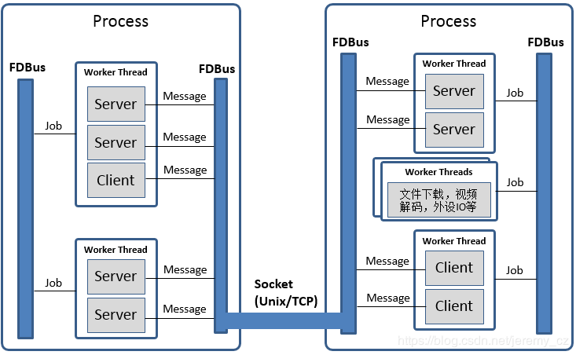

FDBus Manual
============

Abstract
--------

This manual describes a new type of ``IPC`` mechanism: Fast Distributed Bus (``FDBus``). 
From the perspective of ``IPC`` (Inter-Process Communication), ``FDBus`` has similarities 
with widely used ``D-Bus`` (Desktop Bus), but ``FDBus`` has its own advantages, more complete 
functions, higher performance and convenient use, in addition to supporting ``IPC`` in the host. 
It can also be networked between multiple hosts, and can customize security policies to support 
different security levels. ``FDBus`` is built on sockets (``Unix`` domain and ``TCP``) and 
serialized and deserialized using Google protobuf. ``FDBus`` supports the name of a string as 
the server address. The ``name server`` automatically assigns a ``Unix`` domain address and a 
``TCP`` port number to the server, so that the service name is used between the client and the server.

``FDBus`` aims to provide a connection-oriented, scalable, secure and reliable ``IPC`` mechanism 
between client-servers, and then develop into a middleware development framework for cross-platform 
(``Windows``, ``QNX``, ``Linux``), multi-threaded/multi-process middleware layers which working together. 
The ``FDBus`` development framework is suitable for developing interactive and complex distributed 
projects on custom systems, including:

- Linux-based vehicle ``ECU``, including instrumentation, entertainment host, TBox, 
  domain controller connected via Ethernet
- Communication between multiple Guest OSs on ``Hypervisors``
- Provide cross-host ``IPC`` mechanism for Android system (currently does not support ``Java API``)
- Small communication devices based on ``Linux``, such as home routers
- Other Linux-based industrial equipment, smart equipment
- Automated test equipment based on ``Windows`` development

You may get the open source code of FDBus on Github:
  https://github.com/jeremyczhen/fdbus.git

Background
----------

Unlike other cores, ``Linux`` has not had its own unique and easy-to-use ``IPC`` mechanism. 
``Windows``, ``Mac OS``, and ``QNX`` all have such a mechanism. Even Linux-based ``Android`` 
has developed a binder for ``IPC``. The ``Linux kernel`` only provides some of the most basic 
components - socket, pipe, message queue, shared memory, and so on. This is also in line with 
the ``Linux`` philosophy: each tool only does one thing and does it well. But the reality is 
often very complicated, and only one thing can't solve the problems encountered in reality, 
let alone product development and large commercial projects. For example, subscription-broadcasting 
is a basic communication requirement, but no basic component can satisfy it.

Actually ``Linux`` has a powerful ``IPC``: ``D-Bus``. It has sophisticated method invocation mechanisms 
and event broadcast mechanisms; it also includes advanced features such as security policies and 
on-demand startup of services. But the biggest controversy about it is performance: its performance is 
very low, due to the daemon relay, a request-reply needs to replicate ten times, four message verification, 
and four context switches. Therefore, it can only be used to handle control commands and message delivery 
with lower real-time requirements and smaller data volume, otherwise it will have to resort to the basic 
``IPC`` framework. For this reason, someone wrote ``D-Bus`` into the kernel and generated ``KDBus``. 
Although the performance is improved, the disadvantages are obvious. It can only be run on a single machine 
and does not support cross-host. In this case, Android's Binder is also sufficient, and Binder has been 
accepted by the kernel. ``KDBus`` has not yet `"turned positive"`. In addition, whether it is DBus or 
``KDBus``, the provision of the basic API, there is still a big gap from the "middleware development framework." 
However, there is an increasing demand for various industries, including the automotive industry, so that 
various DBus packages are produced: Qt DBus, gDBus, commonAPI, ``DBus-C++``... But these packages are either 
subordinate to the big frame. Or lack of maintenance, in short, it is not friendly to use.

In the automotive field where ``Linux`` and ``Ethernet`` are used more and more widely, the lack of suitable 
``IPC`` has gradually become a prominent problem: the company's original ``IPC`` mechanism is backward due to 
backward technology and obvious customization, and it has been unable to meet the requirements of distributed, 
high performance and security. However, it is unable to find a suitable ``IPC`` mechanism for the new platform, 
let alone a middleware development framework derived from the IPC mechanism. ``Ethernet`` in-vehicle applications 
have spawned ``SOME/IP`` (Scalable service-Oriented MiddlewarE over IP). SOME/IP is also a relatively complete 
``IPC`` specification, even developed specifically for the automotive industry. But as the name implies, it is 
based on the IP layer and does not perform well on a single machine. And ``SOME / IP`` open source implementation 
is also very few, GENIVI organization contributed vsomeip, but the activity is very low, ``GENIVI`` itself is a 
loose organization, more participants, fewer developers. Unlike ``DBus``, ``SOME/IP`` is built for the car and has 
a narrow range of applications. It is impossible to expect an active community to gather a group of professional 
programmers to maintain open source (this is probably why ``GENIVI`` is not a climate). Finally, it is very likely 
that you have to pay for closed source software.

``FDBus`` was developed to solve the above problems and has the following characteristics:

- Distributed: Based on TCP sockets and Unix Domain sockets (UDS), it can be used for both local 
  ``IPC`` and ``IPC`` between network hosts.
- Cross-platform: Currently verified on ``Windows``, ``Linux`` and ``QNX``
- High performance: point-to-point direct communication, not forwarded through a central hub or broker
- Security: Ability to configure different levels of access for server method calls and event broadcasts. 
  Only clients with high enough permissions can characterize methods and receive specific events.
- Service name resolution: The server address is identified by name, the service is registered by 
  the name server, and the name is resolved, so that the server can be deployed anywhere on the network.
- Support cross-platform middleware development framework, including the following components:
 * Thread model
 * Event Loop
 * Job-to-thread communication based on Job-Worker
 * Event Loop based Timer
 * Event Loop based watch
 * Mutex
 * Semaphore
 * Socket
 * Notification
- IPC adopts Client-Server mode and supports the following communication modes:
 * Sync request with timeout - reply
 * Asynchronous request with timeout - reply
 * Unanswered command request
 * Registration-release mode for multicast
- IPC message serialization and deserialization using Protocol buffer, support IDL code generation, 
  efficient and simple; also supports raw data format, convenient for large data transmission
- Reliable heartbeat and reconnection mechanisms ensure that all parties remain connected regardless 
  of network conditions, regardless of which service is back online or restarted
- C++ implementation, easy to develop and maintain

Mainstream IPC framework comparison
-----------------------------------

+------+--------+-----------------+---------+--------------+-----------+--------------------+----------+----------+------------+
|      || Bottom| performance     || Sync   || Asynchronous|| Request  ||    Cross-host     || Message || Cross-  || security  |
|      || layer |                 || request||  request    || timed out|                    || push    || platform|| strategy  |
+======+========+=================+=========+==============+===========+====================+==========+==========+============+
|FDBus | Socket || Point-to-point,|   YES   |      YES     |    YES    || YES               || YES     || Window  || YES       |
|      |        || high           |         |              |           || with timeout      || with    || Linux   || Developing|
|      |        || performance,   |         |              |           || and heartbeat     || simple  || QNX     |            |
|      |        || second only to |         |              |           || to ensure reliable|| string  |          |            |
|      |        || Binder         |         |              |           || connection        || matching|          |            |
+------+--------+-----------------+---------+--------------+-----------+--------------------+----------+----------+------------+
|GDBus | Socket || Turned by      |    YES  |      YES     |    YES    || YES               || YES     || Window  || YES       |
|      |        || daemon,        |         |              |           || but needed        || with    || Linux   || Developing|
|      |        || lower          |         |              |           || maintaining       || complex || QNX     |            |
|      |        || performance    |         |              |           || reconnection when || matching|          |            |
|      |        |                 |         |              |           || network fails     ||         |          |            |
+------+--------+-----------------+---------+--------------+-----------+--------------------+----------+----------+------------+
|Binder|| Binder|| Direct copy,   |   YES   || YES         || YES      |         NO         || YES     || Only    | YES        |
|      || driver|| highest        |         || but need to || but need |                    || but need|| Linux,  |            |
|      |        || performance,   |         || use a       || to       |                    || to use a|| requires|            |
|      |        ||                |         || callback    || increase |                    || callback|| kernel  |            |
|      |        |                 |         || package     |           |                    || package || driver  |            |
+------+--------+-----------------+---------+--------------+-----------+--------------------+----------+----------+------------+

Middleware model based on FDBus
-------------------------------

The following figure is an example of a middleware layer based on ``FDBus`` development:

The middleware layer contains multiple processes, whether they are on the same host system or 
on different host systems. Each process can run multiple threads. FDBus runs a specific event 
loop on a thread basis, enhancing the generic thread to a worker thread capable of executing jobs, 
timers, and watches. The communication side of ``FDBus``: client and server are collectively called 
endpoint. Endpoints can be deployed on different workers; multiple endpoints can also share the 
same worker. "Endpoint deployed on the worker" means that the event processing of the endpoint 
is executed on the worker. For example, the server processes the client request on the specified 
worker; the client processes the asynchronous reply and the broadcast event of the server on the 
specified worker. Middleware developers can use a worker to handle multiple endpoint events 
according to the actual situation, avoiding consuming too many threads, and avoiding the 
"concurrency disaster" caused by multithreading. Developers can also use multiple workers for 
an endpoint service. For example, endpoint can create worker threads to complete time-consuming 
file downloads, video codecs, peripheral IO operations.

Multi-threaded collaborative work requires that messages and data be passed between threads. 
For example, if the file is downloaded, the endpoint should be notified for subsequent processing. 
In the process, because the same address space can be accessed, the best communication carrier is 
the object - both data can be carried and the data can be processed. Job is the object that 
``FDBus`` transfers between threads, and realizes inter-process communication through the transfer 
and execution of jobs between threads.

A more important feature of FDBus is interprocess communication (``IPC``). Objects cannot be 
directly passed between processes, can only interact in the form of messages, and need to be 
serialized during message transmission. After receiving the message, deserialization is required. 
Each ``IPC`` mechanism, including ``Binder``, ``SOME/IP``, and ``DBus``, has its own serialization 
method. The quality of serialization directly affects communication efficiency, load, support for 
data structures, and ease of use. FDBus does not have its own serialization method, directly uses 
google protocol buffer, easy to use, full-featured, and supports idl automatic code generation. 
Data is communicated between processes using sockets, including Unix Domain Sockets (``UDS``) and 
``TCP`` sockets. Which type is used, the system will automatically choose according to the deployment 
of Client and Server: if ``UDS`` is used inside the same host, otherwise ``TCP`` socket is used. 
For ``Windows``, since ``UDS`` is not supported, all ``TCP`` sockets are used.

FDBus addressing and networking
-------------------------------

Server address
^^^^^^^^^^^^^^

